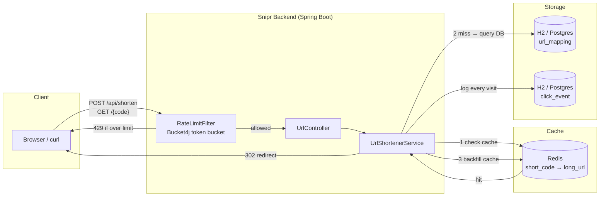

# 🔗 Snipr — Link Shortener with Analytics

> A production-style URL shortener built to learn real system design concepts: caching, rate limiting, and analytics — not just "make a short link."


---

## 📖 What is this?

Snipr takes a long URL and gives you back a short one — but under the hood, it's built the way a real high-traffic service would be: every redirect is logged as an analytics event, hot links are served from a Redis cache instead of hammering the database, and abusive traffic gets rate-limited before it ever reaches the business logic.

This project exists to *learn by building* — every layer is deliberately explained and documented, not just implemented.

---

## 🏗️ Architecture



**Request flow for a redirect (`GET /{code}`):**
1. Request hits the `RateLimitFilter` first — if the client's token bucket is empty, it's rejected with `429` before touching any business logic.
2. `UrlShortenerService` checks Redis for the short code (**cache-aside pattern**).
3. **Cache hit** → return immediately, database never touched.
4. **Cache miss** → query the database, then backfill Redis so the *next* request is a hit.
5. Every visit (hit or miss) is logged as an append-only `click_event` row for analytics.
6. Client receives a `302 Found` redirect to the original URL.

---

## ✨ Features

| Feature | Status |
|---|---|
| Short link generation (Base62-encoded auto-increment ID) | ✅ Done |
| Redirect with 302 (preserves analytics tracking) | ✅ Done |
| Click analytics logging (timestamp, referrer, user-agent, IP) | ✅ Done |
| Redis caching (cache-aside pattern, TTL-based expiry) | ✅ Done |
| Rate limiting (Bucket4j token bucket, per-IP) | 🔧 In progress |
| Custom slugs, link expiration, password protection | 🔜 Planned |
| React analytics dashboard | 🔜 Planned |
| Public deployment | 🔜 Planned |

---

## 🧠 System design concepts demonstrated

- **Cache-aside pattern** — application code explicitly manages cache population/invalidation, rather than relying on write-through caching.
- **Append-only event logging** — raw click events are stored individually rather than as a single mutable counter, preserving full analytical detail (referrer, device, timing).
- **Token bucket rate limiting** — smooths bursty traffic while still enforcing a steady average request rate, versus a naive fixed-window counter.
- **302 vs 301 redirects** — deliberately uses 302 so every click continues to route through the server (needed for analytics), rather than letting browsers cache the redirect via 301.
- **Base62 ID encoding** — collision-free short code generation with no need for uniqueness retries, unlike random-string approaches.

---

## 🛠️ Tech Stack

**Backend:** Java 21 · Spring Boot 4 · Spring Data JPA · Spring Data Redis · Bucket4j
**Database:** H2 (dev) — swappable for PostgreSQL in production
**Cache:** Redis (via Docker)
**Frontend:** React *(planned)*

---

## 🚀 Getting Started

### Prerequisites
- Java 21+
- Maven
- Docker (for Redis)

### Run Redis
```bash
docker run --name snipr-redis -p 6379:6379 -d redis
```

### Run the app
```bash
cd snipr
mvn spring-boot:run
```

App starts on `http://localhost:8080`.

### Try it
```bash
curl -X POST http://localhost:8080/api/shorten \
  -H "Content-Type: application/json" \
  -d '{"longUrl": "https://www.google.com"}'
```

Then visit the returned `shortUrl` in your browser — it'll redirect you and log the click.

---

## 📡 API Reference

| Method | Endpoint | Description |
|---|---|---|
| `POST` | `/api/shorten` | Create a short URL. Body: `{"longUrl": "..."}` |
| `GET` | `/{code}` | Redirects to the original URL (302), logs the click |
| `GET` | `/h2-console` | Browse the local database (dev only) |

---

## 🗺️ Roadmap

- [x] Project skeleton
- [x] Persistence (JPA + Base62 short codes)
- [x] Redirect endpoint + click logging
- [x] Redis caching
- [ ] Rate limiting (Bucket4j)
- [ ] Custom slugs, expiration, password-protected links
- [ ] React analytics dashboard
- [ ] Public deployment

---

## 📄 License

MIT
